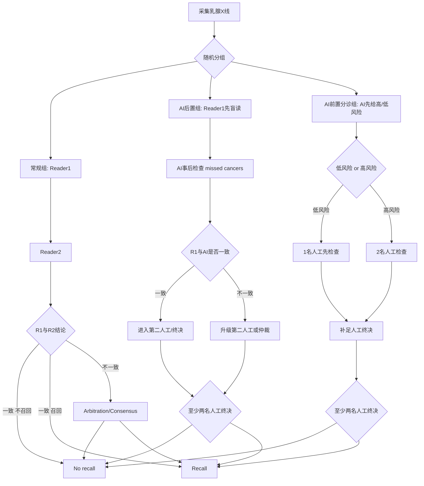
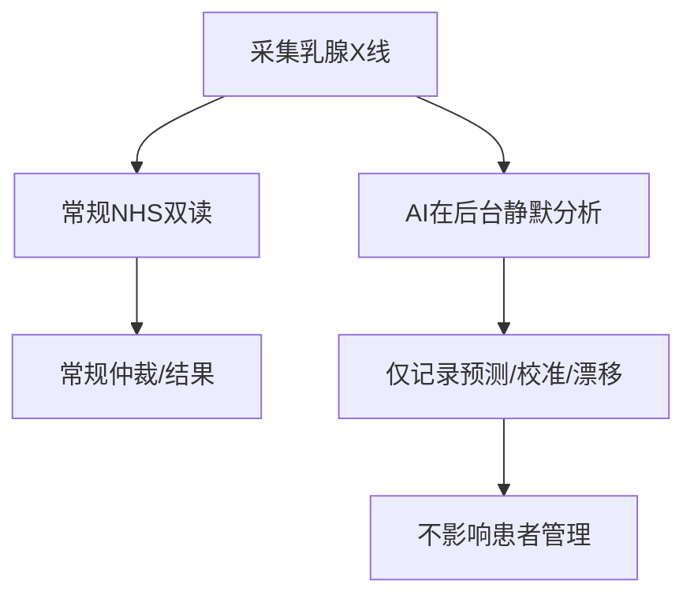
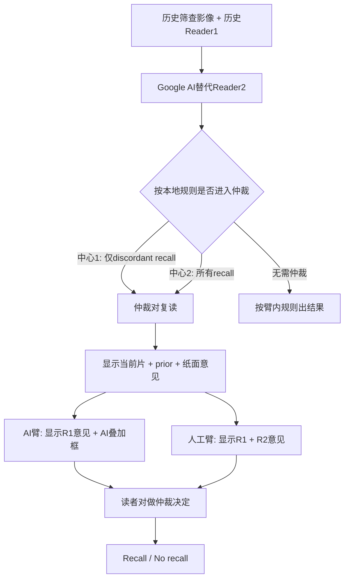
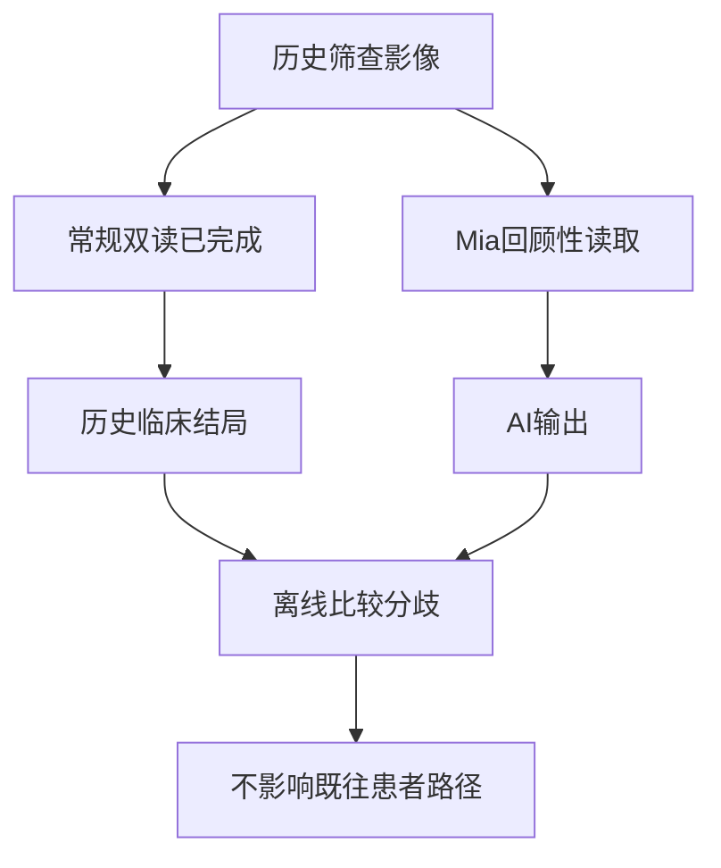
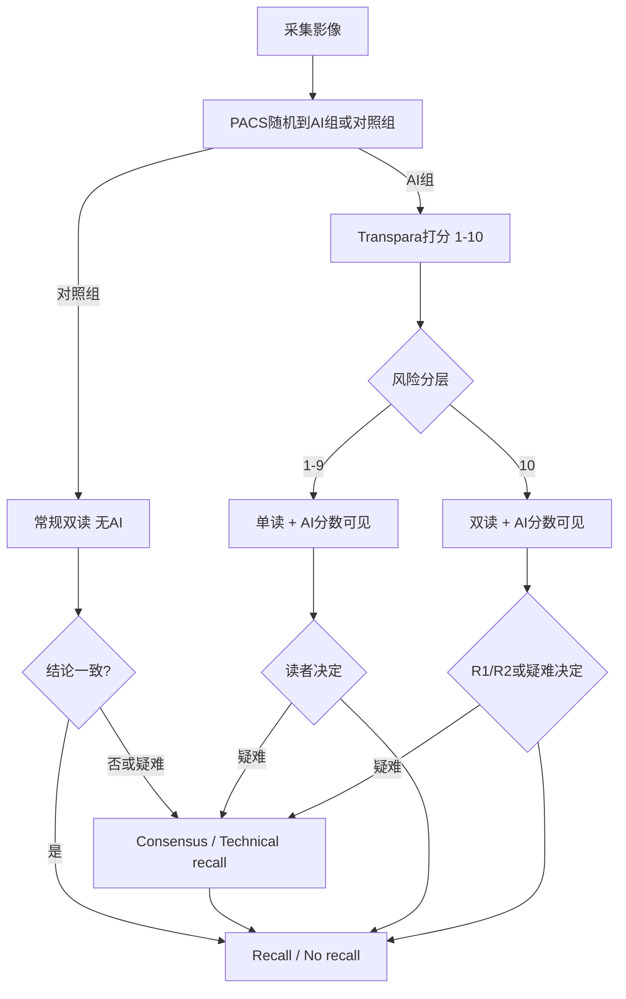
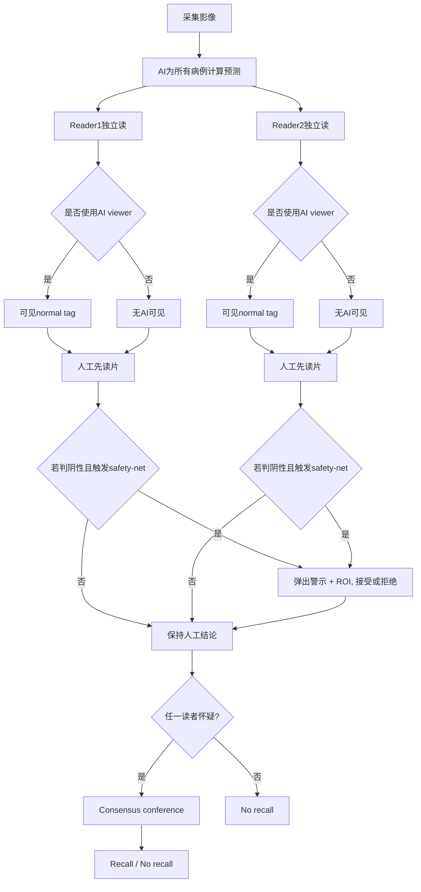
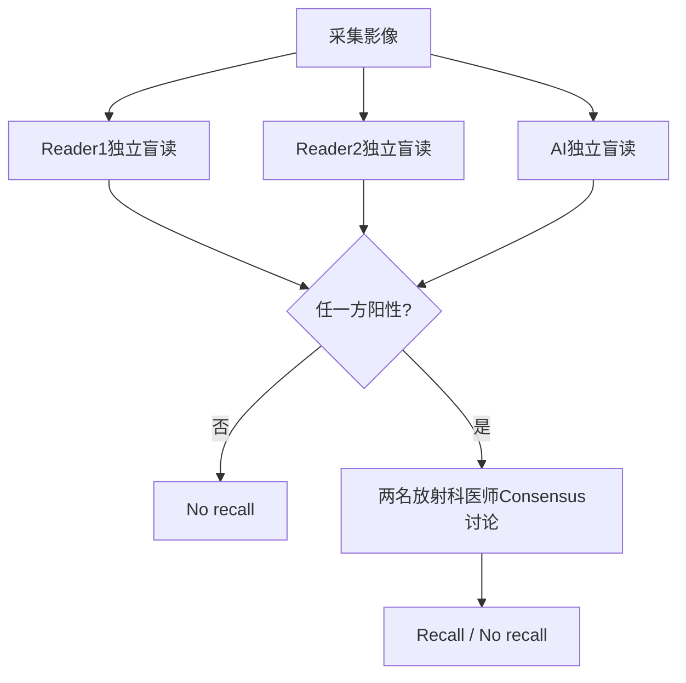
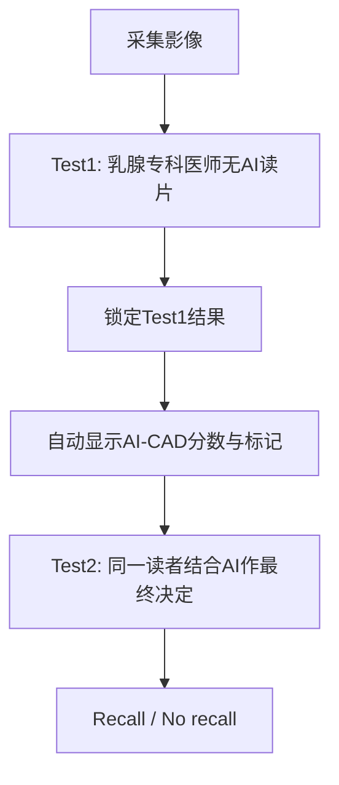
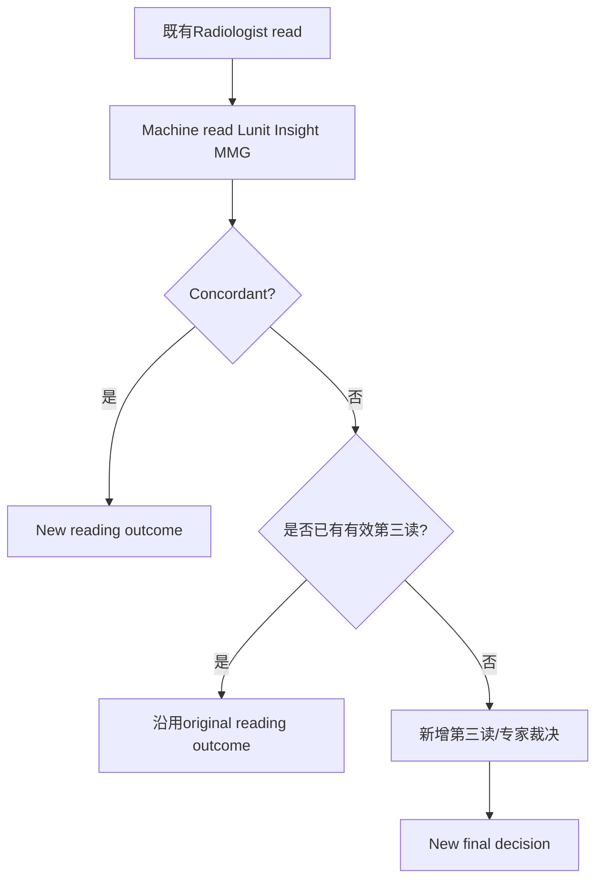
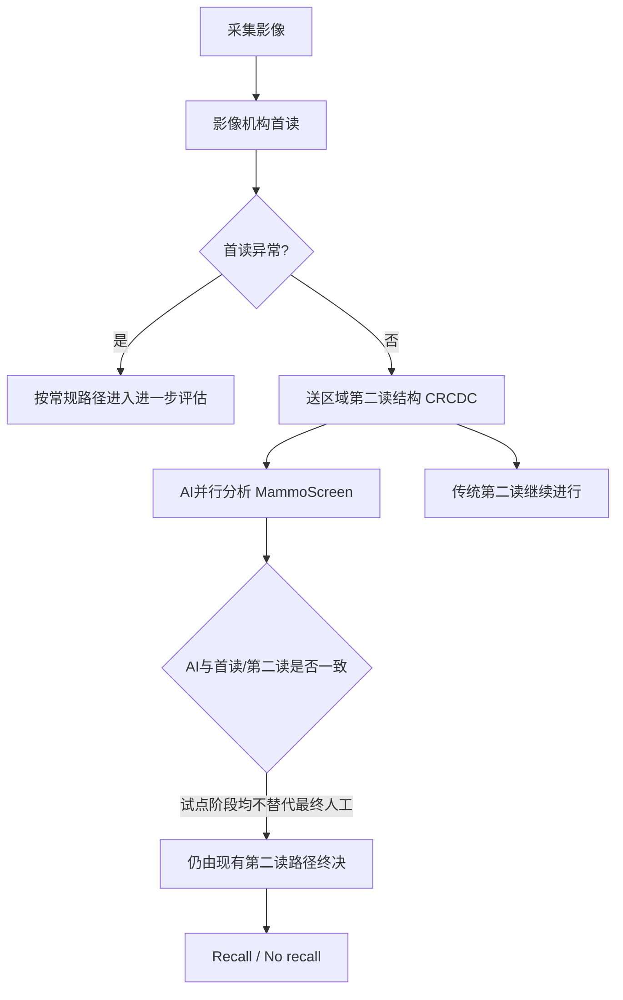

# AI在乳腺癌筛查工作流中的试点实施与分歧场景

## 执行摘要

截至 2026 年，英国语境下对 AI 进入乳腺筛查工作流的态度，仍然是“**以大型前瞻性临床评价替代直接常规上线**”。最核心的英国项目是 2025 年启动的 **EDITH**：这是一项 NIHR 资助、约 30 个中心、计划纳入约 66 万至近 70 万名受检者的多厂商平台式研究，公开材料显示它不是简单测试“AI 能不能读片”，而是在同一国家筛查路径里同时测试至少两种不同介入位置：一类是 **AI 后置 safety-net**，另一类是 **AI 前置分诊/风险分层**。公开资料尚未披露厂商名单，但已经清楚表明：最终决定仍由人工完成，而且至少两名人工专家会对最终癌症检出相关决策负责。citeturn4view0turn5view0turn7view0

英国已经发表的高价值证据并不只是“AI 准确率”本身，而是 **AI 放进真实 NHS 工作流后，分歧如何被触发、如何被看到、又如何被仲裁**。AIMS 项目中的两篇 2026 Nature Cancer 论文尤其关键：一篇显示 Google 的乳腺筛查 AI 在 5 个 NHS 服务的回顾性评估中，面对 115,973 例筛查可达到较首位人工读者更高的癌症检出潜力，并在 12 个站点的前瞻性静默部署中暴露出 **校准、漂移、纸质流程与数字化不足** 等落地问题；另一篇专门研究 **AI 替代第二读者后，包含 arbitration 的完整 NHS 双读流程**，发现 AI 臂整体可减少 46% 的常规读取量，但仲裁量会明显上升，而且部分本可由 AI 更早发现的癌症，会在仲裁阶段被人工推翻。citeturn40view2turn40view3turn42view0turn41view2

国际上最成熟的对照证据来自三类路径。第一类是 **随机对照试验**，以瑞典 **MASAI** 为代表：AI 被用于风险分层与高风险病例检测支持，最终结果显示区间癌率下降且阅读工作量显著下降。第二类是 **真实世界全国/多中心实施**，以德国 **PRAIM** 为代表：AI 作为 decision-referral 工具嵌入双读流程，在 12 个站点上将乳腺癌检出率从 5.7/1000 提升到 6.7/1000，而召回率并未升高。第三类是 **局部临床路径改造**，如瑞典 **ScreenTrustCAD**、韩国 **AI-STREAM**、澳大利亚 **BreastScreen NSW** 方案和法国 PACA 的 **Therapixel 第二读平行试点**，它们共同说明：真正关键的问题不是“AI 会不会发现病灶”，而是 **谁在什么时候看到 AI，看到后是否改变意见，改变后是否进入仲裁，以及仲裁对 AI 真阳性会不会发生系统性压制**。citeturn23view0turn26search2turn27view2turn31view0turn33view1turn35view0turn11view2turn18search0

如果你的项目要讨论 “disagreement”，最不应该把它只定义成一个单点事件。现有证据表明，乳腺筛查 AI 工作流里的分歧至少有八类：**人机初读分歧、人人双读分歧、AI 分诊阈值分歧、安全网触发后的接受/拒绝分歧、仲裁分歧、病例级与病灶级定位分歧、随访后发现的 hindsight 分歧、以及因站点校准漂移造成的伪分歧**。其中，真正最值得项目深入讨论的，是 **“AI 正确但没有被工作流吸收”的分歧**，因为这类分歧最直接关联到 interval cancers、next-round cancers、仲裁界面设计和 reader trust。citeturn41view2turn33view1turn31view0turn40view3

## 检索范围与方法

本报告优先检索并交叉核对了英国官方与一手来源，包括 **NIHR、GOV.UK、HRA、NHS/Trust 官方页面、ClinicalTrials.gov、德国 DRKS、同行评议论文摘要或可访问全文、以及厂商官方试点/产品文档**。检索重点不是所有 AI 乳腺影像论文，而是 **已经进入真实或准真实筛查工作流** 的项目，包括随机试验、前瞻性 paired-reader 研究、真实世界实施、静默部署、以及明确说明了 workflow integration 的 vendor pilots。对未公开或无法从一手公开材料确认的字段，本报告一律标注为 **unspecified**，不做猜测。

在“英国优先”的前提下，我把项目分成三层：第一层是 **英国政策/临床采纳最相关** 的项目；第二层是 **国际上已经提供强 workflow 证据** 的比较组；第三层是 **厂商推动但证据尚不完整的部署/平行试点**。这样做的原因是：如果你的目标是讨论 AIMS/EDITH 风格的“分歧场景”，真正需要对标的不是单纯算法性能论文，而是那些明确公开了 **谁看 AI、何时看 AI、何处进入 arbitration、以及 data capture 如何完成** 的研究。

## 英国语境下的项目全景

下表汇总了本次检索中能确认的英国主要试点、研究与 vendor-driven 实施。

| 项目 | 启动时间 | 站点与规模 | AI 厂商/模型 | 设计与 AI 角色 | 主要终点 | 关键结果或状态 | 主要来源 |
|---|---|---:|---|---|---|---|---|
| **EDITH** 英国 | 2025 年 2 月启动 | 约 30 个中心；公开材料写法为约 660,000 人或“nearly 700,000 women” | **unspecified**；NIHR commissioning brief 明确要求多厂商平台式研究 | 平台式前瞻性研究；至少三组：标准双读、**AI 后置 safety-net**、**AI 前置分诊/风险分层** | 癌症数量/大小/类型、召回、interval cancers、成本效益、工作量、亚组公平性、可接受性 | 正在进行；暂无结果；最终决定仍由人工完成，且公开受试者材料写明至少两名人工专家参与最终癌症检测决策 | NIHR 新闻、委托简报、Warwick 受试者信息 citeturn4view0turn5view0turn7view0 |
| **AIMS Part C** 英国静默部署 | 伦理批准 2022；部署期 2023 年底到 2024 年初 | 两个 London screening services，覆盖 12 个站点；前瞻性静默部署 9,266 例；回顾性评估 115,973 例 | Google mammography AI v1.2 | 非干预、**silent deployment**；AI 不影响患者管理 | 主要终点为相比第一人工读者的敏感度/特异度；同时评估部署可行性、漂移、校准与 workflow fit | 回顾性结果支持 AI 对首读者更高敏感度且特异度非劣；前瞻性静默部署发现实际落地仍受限于 operating point 校准、工作流纸质化和站点差异 | Nature Cancer 2026、HRA 项目摘要、Google/Imperial 解读 citeturn40view2turn40view3turn11view1turn14view3 |
| **AIMS arbitration study** 英国 | 2026 发表 | 两个 NHSBSP 中心，代表性 50,000 名女性；8,732 个需仲裁病例由 22 位读者复审 | Google mammography AI v1.2 | 回顾性 end-to-end 模拟；**AI 替代第二读者**，并显式纳入 arbitration | 仲裁后 case-level 敏感度/特异度非劣性；工作量变化；人因反馈 | 仲裁后敏感度 AI 臂 49.2%，人工臂 48.0%；总常规读取量下降 46%，但 arbitration 在中心 1 增加 142%、中心 2 增加 22%；有 93 个 AI 正确召回的阳性病例在仲裁被人工推翻 | Nature Cancer 2026 citeturn41view1turn41view2turn42view0 |
| **Royal Free / NLBSS – Mia retrospective evaluation** 英国 | 2021 公布 | Edgware 的 North London Breast Screening Service 为其中一个站点；该点每年约 50,000 人；全国 14 个站点参与 | Kheiron **Mia** | 回顾性 **shadow evaluation**；AI 事后读既往 mammograms，与历史双读结果比较 | 比较 AI 与现行双读表现；评估是否可能替代第二读者 | 公开页面未给出最终发表结果；明确说明患者路径不受影响，因为所有影像都已在常规路径中由至少两位放射科医师读取 | Royal Free London 官方页面 citeturn7view3 |
| **EMRAD AI in Mammography Test Bed** 英国 | 2018–2020 | East Midlands Imaging Network，7 家 NHS trusts；多为回顾性校准/验证与流程测试 | Kheiron **Mia**；另含 Faculty 的运营优化模块 | NHS test-bed / pre-deployment evaluation；用于设定 operating point、信息治理和未来 prospective NHS pilot 准备 | 可行性、信息治理、公众/员工接受度、能力与效率 | 更接近“部署准备”而非正式前瞻性筛查试点；官方报告未提供患者层面的 prospective screening effectiveness 结果 | EMRAD 官方技术报告、NHS England AI Award lessons citeturn15view0turn15view2 |

英国语境里最重要的结论不是“已经有 routine implementation”，而是 **英国仍处于从 retrospective validation 走向 pragmatic prospective evaluation 的阶段**。这与 UK NSC 和 NIHR 的立场一致：没有足够的 UK prospective workflow evidence 之前，不宜把 AI 直接写入 NHSBSP 常规流程；EDITH 本身就是为填补这个证据缺口而发起的。citeturn38view2turn39view0turn5view0turn4view0

## 国际试点与真实世界实施对照

下表汇总了当前最值得拿来和英国对照的国际前瞻性试验、真实世界部署和 workflow protocols。

| 项目 | 启动时间 | 站点与规模 | AI 厂商/模型 | 设计与 AI 角色 | 主要终点 | 关键结果或状态 | 主要来源 |
|---|---|---:|---|---|---|---|---|
| **MASAI** 瑞典 | 2021 年 4 月开始随机化；2022 年末完成主要入组 | 四个筛查点：Malmö、Lund、Landskrona、Trelleborg；最终分析约 105,915 人 | ScreenPoint **Transpara v1.7.0** | 随机、单盲、平行对照；**AI 风险分层 + 高风险检测支持**；risk 1–9 单读、risk 10 双读 | 主要终点：interval cancer rate；次要终点：CDR、recall、false positive、workload、肿瘤特征 | 2023 安全性分析显示工作量下降显著；2025/2026 后续结果显示 screen-detected cancers 增加、interval cancers 下降，且两年随访中 interval cancer rate 约 1.55/1000 对 1.76/1000，约下降 12% | Lancet Oncology 2023 PDF、Lund University 2025/2026 新闻、Lancet 2026 摘要检索结果 citeturn24view0turn19search7turn19search3turn26search2 |
| **PRAIM** 德国 | 2021 年 7 月–2023 年 2 月 | 12 个站点；463,094 人筛查，260,739 人进入 AI 支持组；119 名放射科医师 | Vara **Vara MG** | 前瞻性、非干预、真实世界 implementation；**decision referral**：normal triage + safety net，嵌入双读 | 主要终点：breast cancer detection rate 和 recall rate；后续还看 interval cancer/program sensitivity | AI 组 BCDR 6.7/1000，对照 5.7/1000，提升 17.6%；recall rate 37.4/1000，对照 38.3/1000，不劣且略低；PPV 亦提高 | Nature Medicine、DRKS 注册、PRAIM PDF citeturn27view2turn27view1turn31view0 |
| **ScreenTrustCAD** 瑞典 | 2021 年 4 月–2022 年 6 月 | Stockholm、Capio Sankt Görans Hospital；54,991 名女性 | **AI-CAD**；公开可达一手摘要未写明模型名，trial roadmap 常见归因为 Lunit，故此处保守记为 *AI-CAD / vendor not explicit in accessible primary abstract* | 前瞻性 population-based paired-reader non-inferiority；**两位放射科医师 + AI 独立读片**，任一阳性即进入 consensus | 主要终点：screen-detected cancer、recall；后续分析看 interval cancers 与 consensus 中的人机互动 | 已发表主试验提示 “一名放射科医师 + AI” 可实现非劣癌症检出并减少工作量；2025 二次分析显示，AI 触发的病例在 consensus 中更不容易被召回，但其被召回后的 PPV 更高，提示 **AI 真阳性可能在 consensus 被低估** | Radiology 2025 二次分析、ClinicalTrials.gov、trial roadmap / review citeturn33view1turn34search9turn34search6 |
| **AI-STREAM** 韩国 | 起始时间在公开摘要中未明确写出 | 6 家大学医院；24,543 名女性；140 例 screen-detected cancers | **unspecified**（公开可达摘要未明确模型名） | 前瞻性多中心 cohort；国家筛查中的**单读序贯 reveal**：先人工无 AI 读，再显示 AI-CAD，由同一乳腺专科影像医师做最终决定 | 主要终点：1 年内 screen-detected cancer；CDR、RR | 使用 AI-CAD 的乳腺专科影像医师 CDR 为 5.70‰，无 AI 为 5.01‰，提升 13.8%；RR 无显著差异 | Nature Communications、PubMed 摘要 citeturn35view0turn35view1 |
| **BreastScreen NSW fitness-for-purpose protocol** 澳大利亚 | 2024 发表 protocol | 658,207 个连续筛查检查；含 4,383 例 screen-detected 和 1,171 例 interval cancers | Lunit **Insight MMG** | 回顾性连续队列 + 前瞻性数据收集；**AI 替代第二读者的模拟/适配评估** | 比较 combined AI-radiologist 读片与原项目结果的 CDR、RR，并在 discordance 上做新 adjudication | 目前为 protocol，未报告正式结果；但 workflow 设计非常清楚，是当前最适合作为“如何建立 disagreement casebook”的范式之一 | BMJ Open 2024 protocol 与图示 citeturn11view2turn12view0 |
| **Therapixel PACA** 法国 | 2022 年 10 月启动 | 法国 PACA 区 8 个影像机构；5,000 名女性 | Therapixel **MammoScreen** + Solutions Imaging **Gédéon** | prospective real-life study；把 AI 加进法国第二读和数字化传输路径，目标是 **以 AI 自动否定一部分极低风险第二读病例** | 关注 second read reduction、患者安全、数字化第二读效率 | 初始官方材料表明仍保持传统第二读并行，因此属于 **平行验证型实施**；公开一手材料未见正式同行评议结果 | Therapixel 官方新闻与产品文档 citeturn18search0turn18search4 |

除以上“证据性项目”外，公开市场信息还显示 2025–2026 年出现了若干 **国家级或区域级商业部署**。例如，马耳他在 2025 年发布了 AI mammography tender，Lunit 随后在 2026 年投资者材料中称已中标 7 年国家乳腺筛查合同；Lunit 也公开宣称其方案已进入卡塔尔国家乳腺筛查项目。这些信息说明 **商业部署在加速**，但由于缺少与 MASAI、PRAIM 同等级的同行评议 workflow 论文，本报告把它们作为“deployment signals”而不是核心证据。citeturn36search3turn36search2turn36search13

## 工作流差异与分歧场景

先给出一个横向比较表，直接回答你最关心的四个问题：**分歧在哪里触发、谁在什么时候看到 AI、之后怎么升级、以及是否有记录/审计链**。

| 项目 | 谁先看 AI | Reader1 是否盲于 AI | 分歧触发点 | 升级路径 | 记录/审计 |
|---|---|---|---|---|---|
| **EDITH** | 依据试验臂不同：后置组在 Reader1 后才由 AI 介入；前置分诊组 AI 先给风险层级 | 后置组是；前置分诊组不是完全盲，因为 AI 风险层级参与路径分流 | 人机分歧、双人工分歧、分诊阈值分歧 | 第二人工、仲裁/共识；公开材料写明最终由至少两名人工专家作决定 | 国家筛查数据库长期随访；CIMAR 云环境处理影像；退出与 National Data Opt-Out 机制明确 citeturn7view0turn5view0 |
| **AIMS Part C** | 临床团队不看 AI；AI 静默运行 | 是 | 无临床触发型分歧；只有离线 performance/校准分歧 | 无患者级升级，临床仍按常规 NHS 双读 | 静默部署、周度/站点监测、可行性与漂移评估 citeturn11view1turn40view2turn40view3 |
| **AIMS arbitration** | 只在 AI 臂的仲裁阶段显示 AI 叠加框；不显示 case 分数 | 第一历史读者是盲的；仲裁对 AI 可见 | R1 vs AI；不同中心 arbitration criteria；仲裁对 AI 真阳性的 overrule | 进入本地仲裁规则：中心 1 仅仲裁 discordant recalls；中心 2 仲裁所有 recalls | OMI-DB 选例、匿名转录临床纸面意见、双读者成对仲裁、自动质控脚本、读者问卷 citeturn42view0turn41view2 |
| **Royal Free / Mia** | 无临床显示；AI 事后比对 | 是 | 只有历史双读结果 vs AI 的离线分歧 | 无患者级升级 | 全部匿名，结果 study end 比较 citeturn7view3 |
| **MASAI** | intervention arm 的读者在工作列表中可见 risk score；risk 8–10 的 CAD marks 在初读后可见 | 不是完全盲；至少 risk score upfront 可见 | 风险阈值分流；Reader1/Reader2 分歧；reader vs CAD/score 分歧；共识会议分歧 | risk 1–9 单读；risk 10 双读；必要时 consensus / technical recall | PACS 自动随机化；癌症登记与病理核对；后续数据仓库存储以便算法重分析 citeturn24view0 |
| **PRAIM** | 仅使用 AI viewer 的读者可见 normal tag / safety-net；非 AI viewer 读者看不到 | 对不用 AI viewer 的读者是盲的 | 人机分歧主要发生在 safety-net：读者先判阴性后才弹出警示；另有人-人独立双读分歧 | 任一读者可疑即进入 consensus conference；safety-net 可被接受或拒绝 | 官方筛查标准化记录 + AI 系统联结数据库；至少 200 天随访；live monitoring citeturn31view0turn27view0 |
| **ScreenTrustCAD** | 初读阶段人和 AI 相互独立、互盲；AI 的作用体现在进入 consensus 的 triage | 是 | 任一读者或 AI 阳性即触发 consensus；共识阶段出现“AI 触发但人工不召回”的分歧 | 两位放射科医师 consensus 决定 recall / no recall | trial protocol + 后续 interval cancer analysis；公开可达来源未详细说明 UI 审计字段 citeturn33view1 |
| **AI-STREAM** | 同一名乳腺影像医师在 Test1 后立即看到 AI-CAD 结果 | 初始是盲的；随后 reveal | 同一读者的“前后改判分歧”最重要；也可与 standalone AI 比较 | 无第二人升级；最终由同一乳腺专科医师综合判断是否 recall | 同一 research platform 记录 Test1 与 Test2，且 Test1 不能在看完 AI 后回改 citeturn35view0turn35view1 |
| **BreastScreen NSW protocol** | 机器读和既有读片并行；discordance 时触发 additional third read | 历史 radiologist read 对 AI 是盲的 | 既有读者 vs AI discordance | 有效第三读则用原结局；无有效第三读则新增 specialist breast radiologist adjudication | 方案明确要求把原项目结果、AI 结果和新增第三读全部纳入比较 citeturn11view2turn12view0 |
| **Therapixel PACA** | 官方一手材料只明确 AI 与传统第二读并行；前线首读医生是否直接见到 AI **unspecified** | 首读基本仍按传统流程 | 首读阴性但 AI 高风险；AI 低风险拟自动否定第二读；数字化流与传统 film 流并行可能出现流程分歧 | 当前安全设计是 parallel，不替代现有 second read；最终仍由既有项目路径处理 | 依托 Gédéon 做 second-reading dematerialization；并行保留当前流程以确保 patient safety citeturn18search0 |

下面把这些 workflow 用文本图和 mermaid 画出来。为了可读性，我把**最能代表不同分歧机制**的流程都列出；若某些细节在公开一手材料中未详细说明，我已显式写成 *unspecified*。

**EDITH（英国，多臂平台试验）**

文本版：  
常规组是传统 NHS 双读。AI 后置组先由 Reader1 盲读，再由 AI 做 missed-cancer safety-net；若 AI 与人工不一致，则升级到第二人工/仲裁。AI 前置分诊组先由 AI 给高低风险，高风险进入两人检查，低风险进入一人检查，但最终公开材料明确仍由至少两名人工专家负责癌症检测相关终决。厂商名单未公开。citeturn7view0turn5view0

**AIMS Part C（英国，静默部署）**

文本版：  
这是“**没有临床可见分歧、只有系统级可见分歧**”的典型。患者仍走常规 NHS 路径；AI 在后台运行只用于校准、漂移、站点兼容性和 workflow feasibility，不触发 recall。citeturn11view1turn40view2turn40view3

**AIMS arbitration（英国，AI 作为第二读者并纳入仲裁）**

文本版：  
人眼真正看到 AI 的时刻不是 Reader1，而是 **仲裁对**。AI 臂中第二读者由 AI 替代；仲裁时，读者对同时看到第一人工意见和 AI 叠加框。AI 不显示 case-level 分数，只显示 normal/abnormal 和 ROIs。中心 1 只仲裁 discordant recalls；中心 2 仲裁所有 recalls。citeturn42view0turn41view2

**Royal Free / Mia（英国，shadow evaluation）**

文本版：  
最简单的 vendor pilot：患者先按常规双读完成管理；之后 AI 读同一批历史片子，做离线差异比对。这里的 disagreement 是“**分析性分歧**”，不是“路由性分歧”。citeturn7view3

**MASAI（瑞典，AI 风险分层 + detection support）**

文本版：  
MASAI 的分歧非常“结构化”：先由 AI 风险分数把病例分到单读或双读，再在中高风险组里通过 CAD marks 影响读者判断。读者一开始就知道 risk score；但 CAD marks 不是一开始就看，而是先无标记读一次。这里同时存在 **阈值分歧、读者分歧、以及共识分歧**。citeturn24view0

**PRAIM（德国，decision referral）**

文本版：  
这是最典型的 **supporting-reader / safety-net** 设计。AI 对所有病例都算分，但只有使用 AI viewer 的读者才能看到 AI。normal triage 是工作列表层级；safety-net 是 **先人工判阴性，后弹窗警示并给 ROI**。因此，最关键分歧不在初读，而在 **阴性后复议**。citeturn31view0turn27view0

**ScreenTrustCAD（瑞典，paired-reader）**

文本版：  
这是研究 “**谁触发了 consensus**” 的最强范式之一。两位放射科医师和 AI 三方完全独立、相互盲；**任何一方阳性** 都把病例送入 consensus。后续发表的 Radiology 分析表明：AI 触发的病例，进入 consensus 后更不容易被召回，但一旦召回，PPV 更高。citeturn33view1

**AI-STREAM（韩国，单读序贯 reveal）**

文本版：  
这是“**同一读者在看 AI 前后是否改判**”的标准设计。Test1 先记录无 AI 判断；然后自动弹出 AI-CAD 结果；Test2 记录最终决定，而且 Test1 不能被回改。这里的分歧不是“两个主体争执”，而是“**同一读者在 AI reveal 前后是否改变路径**”。citeturn35view0turn35view1

**BreastScreen NSW protocol（澳大利亚，AI 替代第二读者的适配性评估）**

文本版：  
这个方案特别适合你的项目做“disagreement routing”讨论，因为它直接把 discordance 分成两种：**有有效第三读** 和 **无有效第三读**。前者保留原始结果；后者补做新的 specialist adjudication。citeturn11view2turn12view0

**Therapixel PACA（法国，AI 进入第二读平行流程）**

文本版：  
这是更接近法国 organized screening 现实的设计：首读仍在影像机构完成；首读阴性者送 CRCDC 做第二读；AI 和数字化 second-read transmission 并行跑。研究目标是找出 AI 足够低风险、未来可自动否定第二读的区间，但在试点阶段 **仍保留原 second read 作为 patient safety backstop**。citeturn18search0

这些 workflow 共同说明：**“disagreement 发生在哪里”不是一个统一答案，而取决于 AI 被安放的位置**。在 EDITH 和 AIMS arbitration 这类英国式双读-仲裁体系里，重要分歧常发生在 **AI 与 Reader1 的分歧如何被送到 arbitration**；在 PRAIM 里，关键分歧是 **阴性后 safety-net 是否被接受**；在 ScreenTrustCAD 里，关键分歧是 **AI-only positive 是否在 consensus 中被压低**；在 AI-STREAM 里，关键分歧是 **同一读者在 reveal 前后是否改变 decision threshold**；在 MASAI 里，则还要额外考虑 **分诊阈值本身** 已经重写了分歧发生的分布。citeturn31view0turn33view1turn35view0turn24view0turn42view0

## 治理、数据资源与对你的项目的启示

英国治理层面最重要的三份文件和一条主线是：其一，**2021 interim guidance** 已在 2025 年 1 月被撤回，并明确说它已被 **UK NSC position statement / recommendation** 取代；其二，UK NSC 的 2022 Lancet Digital Health 方法学论文强调，评估单位不是单纯的 AI，而是 **“AI 与当前筛查路径组合后的临床结果”**；其三，UK NSC 的证据综述明确指出，在缺乏高质量 UK prospective evidence 前，不应把 AI 直接纳入 NHSBSP 常规流程；其四，NIHR 2023 commissioning brief 把 EDITH 设计成多厂商、可在多路径节点测试 AI 的平台式研究，说明英国监管思路已经从“可不可以搞 pilot”转到“**如何用可监管的 trial design 系统地比较不同 workflow placements**”。citeturn38view0turn39view0turn38view2turn5view0

数据资源方面，如果你的项目要落在英国语境，**OPTIMAM / OMI-DB** 几乎是绕不过去的核心基础设施。OMI-DB 由多家英国乳腺筛查中心的 processed/unprocessed mammograms 与临床病理信息构成，2020 年论文报告时已包含 173,319 名女性、超过 250 万张图像，并且特别有价值的是它包含 **prior screens、screen-detected cancers、benign cases 和 interval cancers**；AIMS arbitration 研究也直接从 OMI-DB 选取 50,000 名女性构建长随访 ground truth。对于英国项目而言，这一点非常关键，因为如果你的 disagreement taxonomy 最终要与 interval cancer 或 next-round cancer 发生联系，没有 longitudinal linked data，很多“AI 正确但没被采纳”的分歧根本无法被识别。citeturn37search0turn37search11turn37search19turn42view0

从你项目的讨论框架看，我建议把分歧分成 **病例级、病灶级、路径级** 三层，而不要只做一个二元标签。病例级分歧问的是 “**recall / no recall** 是否不同”；病灶级分歧问的是 “**有没有看见同一个 lesion、ROI 是否对得上**”；路径级分歧问的是 “**这个病例为什么会被送去或不送去 Reader2 / consensus / arbitration**”。AIMS arbitration 的 93 个“AI 正确召回但被仲裁推翻”的阳性病例，和 PRAIM 里被 safety-net 提示后被接受或拒绝的病例，正说明病例级一致并不等于病灶级一致，病灶级一致也不等于路径级会被正确吸收。citeturn41view2turn31view0

如果要把这个框架真正写进项目，我建议至少记录以下字段：**site、screen type、equipment vendor、R1 盲读结论、AI case-level 输出、AI ROI/score 是否显示、显示时点、R2 结论、是否进入 arbitration、仲裁人员、仲裁结论、最终 recall、pathology、interval/next-round outcome、以及“AI 建议是否被接受”**。这套表头之所以重要，是因为现有文献已经反复显示：“AI 好不好”并不是一条最有解释力的变量，真正有解释力的是 **visibility state、thresholding、human override、以及 site-specific workflow policy**。AIMS 的 workflow mapping 还发现，当时接受调查的 9 个 NHS 服务里有 8 个仍依赖纸张驱动工作流，这意味着如果项目只分析影像级分歧而不分析 paperwork、NBSS 字段和 arbitration 记录，你最后会低估一大部分“系统层面分歧”。citeturn40view3turn41view3turn39view0

就“disagreement 场景全部列出来”而言，最建议你在项目里使用下面这套分类：

| 分歧类型 | 典型定义 | 在哪些项目里最典型 |
|---|---|---|
| **人机初读分歧** | Reader1 与 AI 在第一次可见比较时 recall/no recall 不同 | EDITH 后置组、AIMS arbitration、AI-STREAM、BSNSW protocol citeturn7view0turn42view0turn35view0turn11view2 |
| **人人双读分歧** | Reader1 与 Reader2 结论不同 | 英国常规双读、MASAI 高风险双读、PRAIM、EDITH 常规组 citeturn38view2turn24view0turn31view0turn7view0 |
| **分诊阈值分歧** | AI 风险分层把病例送往单读或双读，改变了分歧分布 | MASAI、EDITH 前置分诊臂 citeturn24view0turn7view0 |
| **安全网接受/拒绝分歧** | 读者先判阴性，AI safety-net 弹出后被接受或拒绝 | PRAIM 最典型 citeturn31view0turn27view0 |
| **仲裁分歧** | arbitration/consensus 把 AI 或某位读者的召回建议推翻 | 英国 NHS、AIMS arbitration、ScreenTrustCAD、MASAI/PRAIM 的 consensus 节点 citeturn38view2turn41view2turn33view1turn24view0turn31view0 |
| **定位分歧** | case-level 都判阳性，但 ROI/病灶位置不一致，导致仲裁不信任 AI | AIMS arbitration 明确量化了这类问题 citeturn41view2 |
| **迟发真相分歧** | 当下未召回，但后续成为 interval cancer 或 next-round cancer，回看显示 AI 或某读者早已提示 | MASAI、AIMS arbitration、BSNSW protocol、OMI-DB-based studies citeturn26search2turn41view2turn11view2turn37search0 |
| **校准/漂移分歧** | 同一 operating point 在不同站点、年份、设备上产生不同召回与特异度 | AIMS Part C、PRAIM 多次更新/live monitoring citeturn40view2turn27view0 |
| **界面与可见性分歧** | 不同 reveal timing 改变读者行为，例如 automation bias 或 disuse | ScreenTrustCAD、MASAI、AIMS arbitration、AI-STREAM citeturn33view1turn24view0turn42view0turn35view0 |

如果你要把讨论落到 AIMS 语境，我会建议你用一句话概括你的核心问题：**“不是 AI 与人谁更准，而是 NHS 双读—仲裁路径在哪些节点系统性地消化不了 AI 的正确意见。”** 这比单纯比较 AUC、sensitivity 或 recall rate，更接近眼下英国真实需要回答的问题，也是 EDITH 与 AIMS 之间最自然的衔接点。citeturn42view0turn40view3turn4view0

## 开放问题与结论

现阶段仍有几个必须保留为开放问题。第一，**EDITH 的具体厂商名单、各臂的详细 decision logic、NBSS/PACS 集成细则和审计字段** 尚未在可公开访问的一手文件里完全披露，因此本报告只能依据 NIHR commissioning brief、GOV/NIHR 新闻和 Warwick 的公众材料重建其高层 workflow。第二，国际比较中有些项目已经是商业部署而非标准学术试验，例如马耳他和卡塔尔的 national deployment announcements，但尚未形成与 MASAI/PRAIM 同等级的同行评议 workflow 论文，因此我没有把它们与 RCT/implementation studies 等量齐观。第三，个别试验的厂商名在公开可达的一手摘要中并未清楚写出，例如 ScreenTrustCAD 与 AI-STREAM，相关字段我已保守标注为 *unspecified* 或加解释说明。citeturn7view0turn36search2turn36search13turn33view1turn35view0

综合来看，当前证据最支持的不是“AI 替代所有人工”，而是三种更现实的路径。其一，是 **AI 作为独立第二读者或第三独立读者**，但必须显式建模 arbitration；其二，是 **AI 作为 supporting reader / safety-net**，尤其适合双读体系，但需要研究 safety-net 是否会被过度拒绝；其三，是 **AI 作为分诊器**，通过风险分层把部分低风险病例从双读转向单读，不过这会把 disagreement 从“读片结论分歧”转移到“路径分流分歧”。英国未来是否规模化采用 AI，真正决定因素很可能不是算法平均性能，而是 **AI 正确意见在 arbitration、visibility design、site calibration 和 audit trail 中能否被保留下来**。citeturn24view0turn31view0turn41view2turn40view3

navlist相关近期报道turn2news40,turn2news42,turn2news41